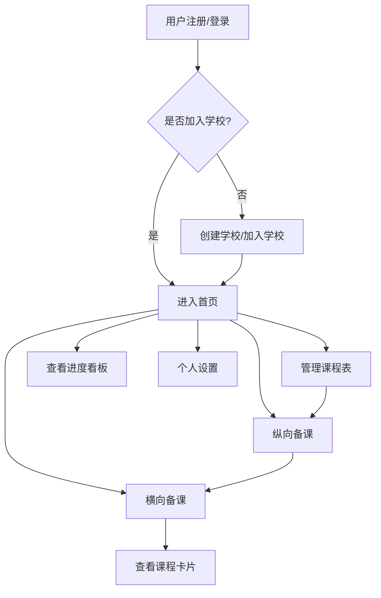

# 复式教育备课系统 - MVP 产品需求文档

## 1. 产品概述

复式教育备课系统是为乡村小规模学校设计的复式教学备课工具，帮助教师同时承担多个年级、多门学科的教学任务，简化备课流程，优化动静搭配。

- 主要解决乡村教师复式备课工作量大、动静搭配难、进度跟踪困难等问题
- 目标用户是乡村复式班教师，核心价值是提供轻量、易上手的复式备课工具

## 2. 核心功能

### 2.1 用户角色

| 角色 | 注册方式 | 核心权限 |
|------|----------|----------|
| 乡村复式班教师 | 手机号注册/登录 | 创建/加入学校，管理课程表，纵向/横向备课 |

### 2.2 功能模块

1. **登录/注册页**: 手机号登录、注册、创建/加入学校
2. **首页(工作台)**: 待备课提醒、快捷入口、近期备课记录
3. **课程表页**: 周视图课程表、备课状态叠加、班级切换
4. **班级管理页**: 班级列表、创建/编辑班级
5. **纵向备课列表页**: 按学科/年级分组的备课方案列表
6. **纵向备课编辑页**: 教学目标、教学步骤编辑器
7. **横向备课页**: 时间线编排界面、动静冲突检测
8. **课程卡片页**: 备课方案的精缩卡片展示
9. **进度看板页**: 各班级各学科备课进度
10. **个人设置页**: 个人信息、学校信息、退出登录

### 2.3 页面详情

| 页面名称 | 模块名称 | 功能描述 |
|---------|----------|---------|
| 登录/注册页 | 手机号登录 | 支持密码登录和验证码登录 |
| 登录/注册页 | 学校管理 | 创建学校、通过邀请码加入学校 |
| 首页 | 待备课提醒 | 显示未完成的备课任务 |
| 首页 | 快捷入口 | 快速访问常用功能 |
| 首页 | 近期记录 | 展示最近使用的备课方案 |
| 课程表页 | 周视图 | 以周为单位展示课程安排 |
| 课程表页 | 拖放排课 | 支持拖放调整课程位置 |
| 课程表页 | 复式班标记 | 同一时段显示多个年级课程 |
| 课程表页 | 备课状态 | 显示已备课/未备课状态 |
| 班级管理页 | 班级列表 | 显示所有班级信息 |
| 班级管理页 | 班级创建/编辑 | 创建或编辑班级，标记复式/单式 |
| 纵向备课列表页 | 方案列表 | 按学科/年级/单元分组展示 |
| 纵向备课列表页 | 搜索功能 | 按课题关键词搜索 |
| 纵向备课编辑页 | 教学目标 | 添加、调整教学目标 |
| 纵向备课编辑页 | 教学步骤 | 添加、编辑、排序教学步骤，设置动静属性和时长 |
| 横向备课页 | 时间线编排 | 多年级轨道时间线，拖拽调整 |
| 横向备课页 | 动静冲突检测 | 实时检测并提示动静冲突 |
| 横向备课页 | 时间总长校验 | 检查步骤总时长与课时是否一致 |
| 课程卡片页 | 卡片展示 | 展示备课方案精缩信息 |
| 进度看板页 | 进度统计 | 展示各班级各学科备课完成情况 |
| 个人设置页 | 个人信息 | 查看和修改个人信息 |
| 个人设置页 | 学校信息 | 查看学校信息 |
| 个人设置页 | 退出登录 | 安全退出系统 |

## 3. 核心流程

### 3.1 主要用户流程

1. 新用户注册 → 创建或加入学校 → 设置课程表 → 纵向备课 → 横向备课 → 查看课程卡片
2. 教师在日常使用中：登录系统 → 查看待备课提醒 → 完成备课 → 查看课程卡片

### 3.2 Mermaid 流程图

## 4. 用户界面设计

### 4.1 设计风格

- **主色调**: 温馨教育蓝色 (#3B82F6) - 代表知识与信任
- **辅助色**: 柔和绿色 (#10B981) - 代表活力与成长
- **强调色**: 温暖橙色 (#F59E0B) - 用于提醒和重点
- **按钮风格**: 圆角矩形，有轻微阴影，hover时有微妙放大动画
- **字体**: 清晰易读的无衬线字体，确保在移动端可读性好
- **布局风格**: 卡片式设计，简洁直观，符合移动端操作习惯
- **图标风格**: 简洁线性图标，与教学场景相关
- **整体风格**: 温暖、亲切、专业，适合乡村教师用户群体

### 4.2 页面设计概述

| 页面名称 | 模块名称 | UI元素 |
|---------|----------|--------|
| 登录/注册页 | 登录表单 | 简洁白色卡片，蓝色主题按钮，输入框有聚焦效果 |
| 首页 | 待备课提醒 | 橙色提醒卡片，列表式展示 |
| 首页 | 快捷入口 | 网格布局，彩色图标按钮 |
| 课程表页 | 周视图表格 | 清晰的表格布局，课程卡片有不同颜色区分学科 |
| 纵向备课编辑页 | 教学步骤编辑 | 可拖拽卡片，动态蓝色卡片，静态灰色卡片 |
| 横向备课页 | 时间线编排 | 多轨道时间轴，卡片宽度代表时长，冲突时红色高亮 |
| 课程卡片页 | 卡片展示 | 精美卡片设计，时间线可视化 |

### 4.3 响应式设计

- **移动端优先设计**: 针对手机屏幕优化，支持 iOS 14+ / Android 10+
- **触摸优化**: 按钮和交互元素尺寸适合手指点击，间距合理
- **自适应布局**: 在不同屏幕尺寸上保持良好的可用性

### 4.4 动画与交互

- **页面切换**: 平滑的滑动过渡动画
- **按钮交互**: 点击时的缩放反馈
- **卡片拖拽**: 流畅的拖拽动画，边界检测
- **加载状态**: 简洁的骨架屏和加载动画
- **错误提示**: 友好的弹窗提示，不中断用户操作

